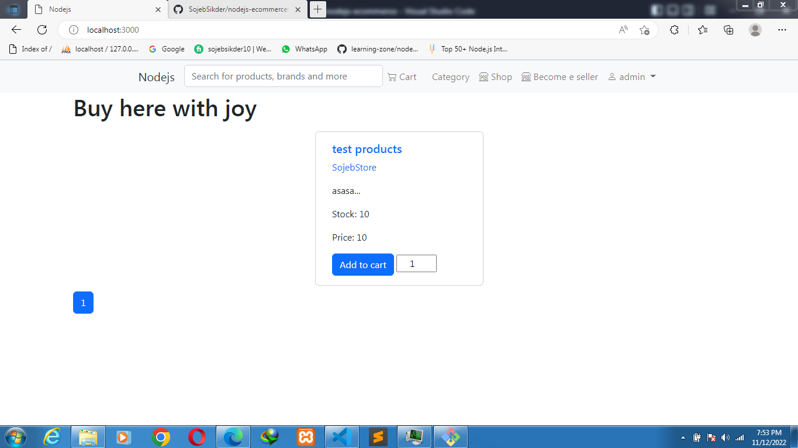
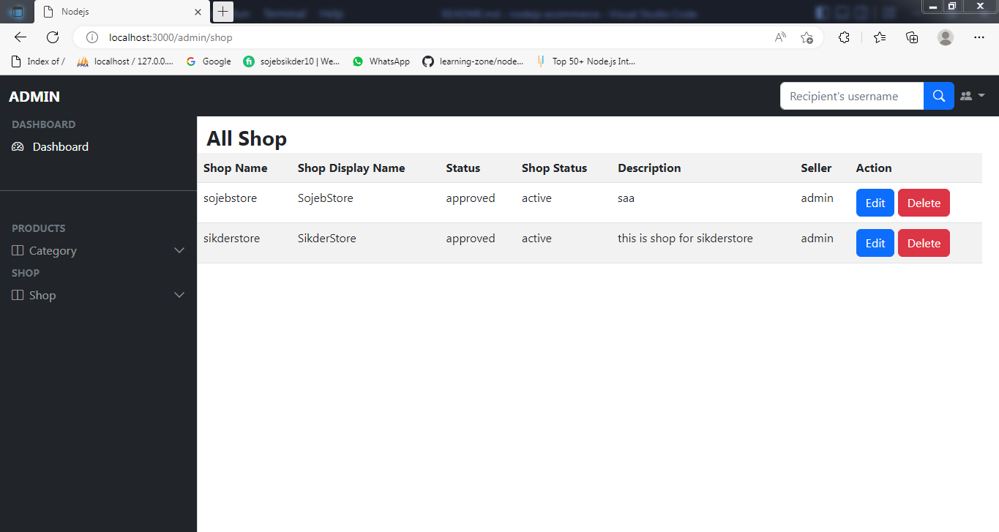
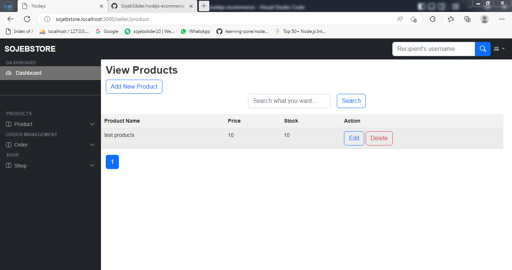

# node-ecommerce

Node.js multivendor e-commerce application





## Features:

- Written in Typescript
- Multi vendor support
  - Multiple seller can sell their products
- Multi domain support
- Admin dashboard
  - Shop management
  - Manage multi level category for product
- Seller dashboard
  - Product inventory management
  - order management
- Payment gateway integration
  - Paypal
  - Stripe
- Order receipt pdf generation
- And much more.

## Configure

- Set up database credentials in env file
- Migrate database using:
  `yarn prisma migrate dev`
- Database seeding using: `yarn prisma db seed`

## Installing

```
yarn install
```

## Production

### Build

```
yarn build
```

### Running

```
yarn start:prod
```

## Development

### Running

```
yarn start
```

### Watch changes

```
yarn start:dev
```

## Technology used

- (Boilerplate) http://github.com/sojebsikder/create-sojeb-express-ts-app

# Contribute

---

If you want to contribute fork the repo, create new branch and make pull request.

## Setup (Contributing)

If you clone this repo then you have to setup these things manually.

- Copy .env.example to .env And set up database credentials in env file
- Migrate database using this command:
  `yarn prisma migrate dev`

## For help and support

Email: sojebsikder@gmail.com

## Issue

If you find any problem please create an issue.
